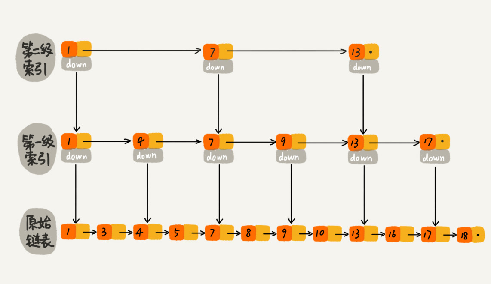

# 链表  
链表是面试中常见的数据数据结构，其适合做增加和删除，不适合查找     

**实现的主要算法如下**   
1. `hasCycleInLinklist`: 判断链表是否有环, 求环的入口，环的长度，链表的长度     
2. `lowestCommonAncestor`: 判断两个无环链表是否相交，如有求两个链表的第一个公共节点   
3. `findLastKNode`: 找到倒数第K的节点  
4. `reverse`: 反转链表，反转打印   
5. `mergeTwoSortLinklist`: 合并两个有序链表   
6. `leetcode/qeustion18.c`: 删除链表的节点

**常见的解决思路**
一般的链表可以用快慢指针来处理，  
1. 一个指针可以先走，然后再同步走   
    - 找倒数第K个节点
    - 求有环链表的环的入口      
2. 同步走，一个每次走两步，一个每次走一步  
    - 判断链表是否有环   
    - 打印链表中间的节点     
3. 两个指针，一前一后   
    - 反转链表   

**如何写出正确的链表代码？**    
1. 理解指针或引用的含义   
2. 技警惕指针丢失和内存泄漏：在插入和删除节点时   
3. 利用哨兵解决链表边界的问题     
4. 重点留意边界条件处理   
    * 如果链表为空时，代码是否能正常工作？   
    * 如果链表只包含一个结点时，代码是否能正常工作？   
    * 如果链表只包含两个结点时，代码是否能正常工作？   
    * 代码逻辑在处理头结点和尾结点的时候，是否能正常工作？   
5. 举例画图，辅助思考   
6. 多写多练，没有捷径  

**跳表**    
跳表使用空间换时间的设计思路，通过构建多级索引来提高查询的效率，实现了基于链表的“二分查找”。跳表是一种动态数据结构，支持快速的插入、删除、查找操作，时间复杂度都是 O(logn)。
